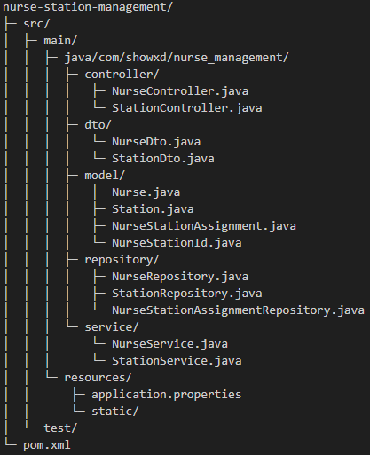
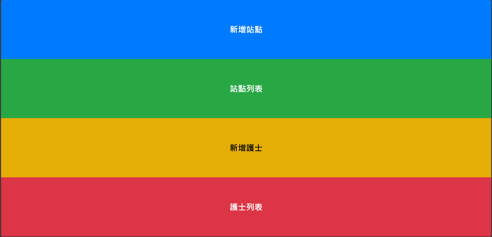

# 醫院護士站點管理系統（Nurse-Station Management）

一套簡易的後端 API + 前端靜態頁面，模擬醫院內「護士（Nurse）」與「站點（Station）」之間的 CRUD 與指派管理功能。

---

## 目錄

1. [專案簡介](#專案簡介)
2. [主要技術](#主要技術)
3. [核心 API 範例](#核心-api-範例)
4. [前端畫面示意](#前端畫面示意)
5. [額外文件連結](#額外文件連結)

---

## 專案簡介

本專案為「護士站點管理系統」，後端使用 Spring Boot 3.x + Spring Data JPA、MySQL，前端以純 HTML + jQuery。  
主要功能：  
- **站點 (Station)**：CRUD  
- **護士 (Nurse)**：CRUD  
- **指派／取消指派**：將護士分配到特定站點

---

## 主要技術

- Java 17+、Spring Boot 3.5.0、Spring Data JPA (Hibernate)、MySQL 8.0.42、Lombok  
- HTML5 / CSS3、jQuery 3.6.0  
- Maven 3.9.9、Git  

---

## 專案檔案結構




## 核心 API 範例

> 若要更完整的所有 API，請參考：`docs/API_FULL.md`。

### 1. 取得所有站點

```
GET /api/stations
```

```json
[
  { "id": 1, "name": "外科", "updatedAt": "2025-06-05T22:05:12" },
  { "id": 2, "name": "內科", "updatedAt": "2025-06-05T22:06:00" }
]
```

### 2. 新增站點

```
POST /api/stations
Content-Type: application/json

{
  "name": "心臟內科"
}
```

```json
{ "id": 3, "name": "心臟內科", "updatedAt": "2025-06-05T22:10:30" }
```

### 3. 取得指定站點（含護士）

```
GET /api/stations/{id}
```

```json
{
  "id": 3,
  "name": "心臟內科",
  "nurses": [
    {
      "id": 5,
      "employeeId": "N005",
      "name": "王小美",
      "assignedAt": "2025-06-04T14:20:00"
    }
  ]
}
```

### 4. 指派／取消指派護士

```
POST   /api/stations/{stationId}/nurses/{nurseId}
DELETE /api/stations/{stationId}/nurses/{nurseId}
```

---

## 前端畫面示意

下方僅放一張示意，更多畫面請參考 `docs/screenshots/`：



> * `nurse-list.html`：顯示護士清單，可新增/編輯/刪除。
> * `nurse-detail.html`：編輯護士詳細、指派站點。
> * `station-list.html`：顯示站點清單，可新增/編輯/刪除。
> * `station-detail.html`：編輯站點詳細、查看／移除已指派護士。

---

## 額外文件連結

* `docs/API_FULL.md`：完整 API 規範（包含 Request/Response 範例、錯誤碼）。
* `docs/nurse_management_dump.sql`：完整資料庫建表 SQL。
* `docs/screenshots/`：所有前端畫面截圖。

---
